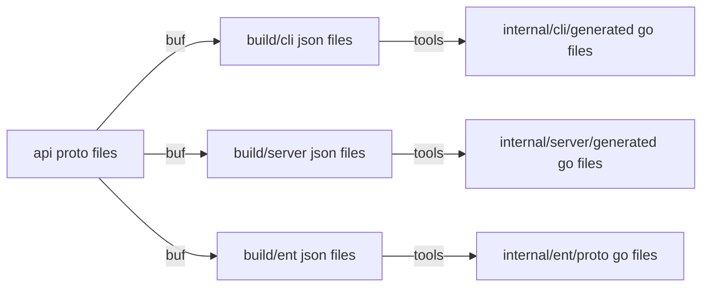

# Design: Protocol Buffers Code Generation

## Overview


The `api` directory contains the protocol buffer files for the API. For each [standard methods](https://cloud.google.com/apis/design/standard_methods) defined in the API, corresponding client and server Go codes are generated.

For example, the `Create` method is defined in [ke.proto](../../api/ke/v1alpha/ke.proto):

```proto
service KeService {
  rpc CreateCluster(CreateClusterRequest) returns (Cluster);
}
```

For the `Create` method, the following [cobra](https://github.com/spf13/cobra) implementation is generated in [createcluster.go](../../internal/cli/generated/ke/v1alpha/cluster/createcluster.go):

```go
cmd := &cobra.Command{
    Use: "create",
    RunE: func(cmd *cobra.Command, args []string) error {
        // ...
    },
}
```

And the following gRPC service implementation is generated in [service.go](../../internal/server/generated/ke/v1alpha/service.go):

```go
type service struct {
	v1alpha.UnimplementedKeServiceServer
}

func (s *service) CreateCluster(ctx context.Context, req *v1alpha.CreateClusterRequest) (*v1alpha.Cluster, error) {
    // ...
}
```

And the following ent query builder is generated in [cluster.go](../../internal/ent/proto/cluster.go):

```go
func ClusterProto(x *ent.Cluster) *v1alpha.Cluster {
...
}

func ClusterCreateQuery(create *ent.ClusterCreate, v *v1alpha.Cluster) *ent.ClusterCreate {
...
}

func ClusterUpdateOneQuery(update *ent.ClusterUpdateOne, v *v1alpha.Cluster) *ent.ClusterUpdateOne {
...
}

```

## Code generation for CLI
| input | command | output |
| --- | --- | --- |
| [api](../../api) | [protoc-gen-cli](../../cmd/protoc-gen-cli/) | [build/cli](../../build/cli) |
| [build/cli](../../build/cli) | [tools cli](../../cmd/tools/) | [internal/cli/generated](../../internal/cli/generated) |

```bash
buf generate --template buf.gen.local.yaml
```

The `protoc-gen-cli` plugin is used to generate JSON file(s) for each CLI command. The JSON file contains the command name, description, flags, etc.. The `inhouse.v1.Package` proto message is used to define the CLI commands.

See [test.json](../../testdata/generator/cli/test.json) for an example of the generated JSON file.

```bash
go run ./cmd/tools cli build/cli/test.json internal/cli/generated github.com/nokamoto/2pf23/internal/cli/generated
```

The `tools cli` command is used to generate the Go code for the CLI commands. The generated code is placed in the `internal/cli/generated` directory.

## Code generation for server
| input | command | output |
| --- | --- | --- |
| [api](../../api) | [protoc-gen-server](../../cmd/protoc-gen-server/) | [build/server](../../build/server) |
| [build/server](../../build/server) | [tools server](../../cmd/tools/) | [internal/server/generated](../../internal/server/generated) |

```bash
buf generate --template buf.gen.local.yaml
```

The `protoc-gen-server` plugin is used to generate JSON file(s) for each gRPC service. The JSON file contains the service name, methods, input/output messages, etc.. The `inhouse.v1.Service` proto message is used to define the gRPC services.

See [ke.json](../../testdata/generator/server/ke.json) for an example of the generated JSON file.

```bash
go run ./cmd/tools servers build/server internal/server/generated
```

The `tools server` command is used to generate the Go code for the gRPC services. The generated code is placed in the `internal/server/generated` directory.

## Code generation for ent
| input | command | output |
| --- | --- | --- |
| [api](../../api) | [protoc-gen-ent](../../cmd/protoc-gen-ent/) | [build/ent](../../build/ent) |
| [build/ent](../../build/ent) | [tools ent](../../cmd/tools/) | [internal/ent/proto](../../internal/ent/proto) |

```bash
buf generate --template buf.gen.local.yaml
```

The `protoc-gen-ent` plugin is used to generate JSON file(s) for each ent query builder. The JSON file contains the resource name, fields, etc.. The `inhouse.v1.Ent` proto message is used to define the ent query builders.

See [cluster.json](../../testdata/generator/ent/test.json) for an example of the generated JSON file.

```bash
go run ./cmd/tools ent build/ent internal/ent/proto proto
```

The `tools ent` command is used to generate the Go code for the ent query builders. The generated code is placed in the `internal/ent/proto` directory.
